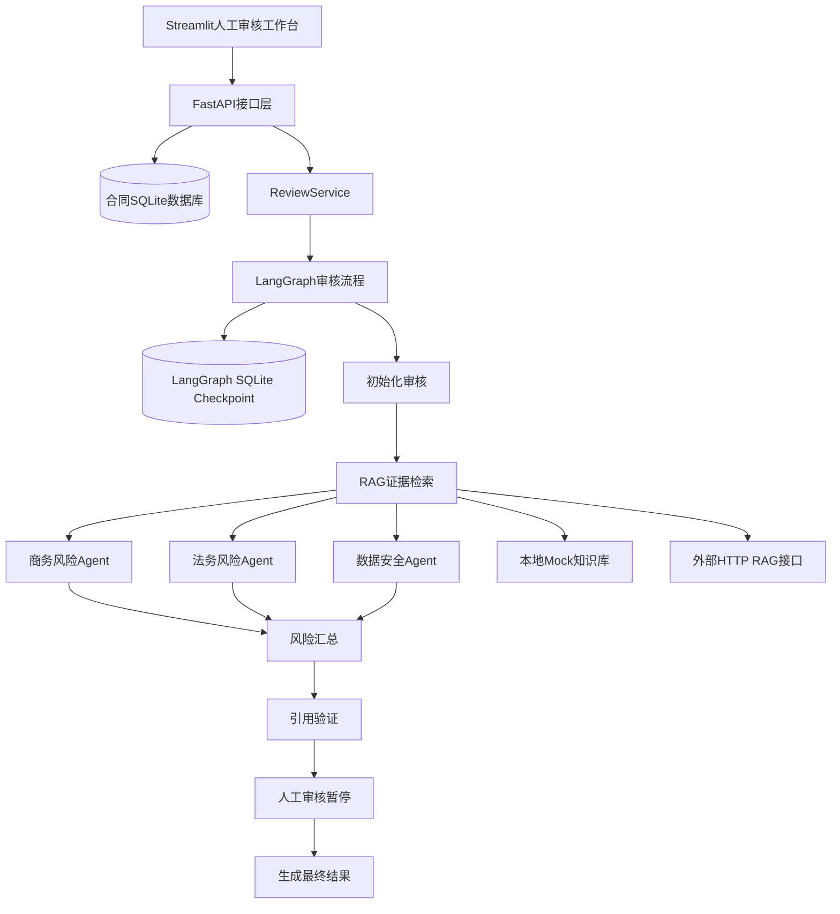

# RailGuard AI

RailGuard AI 是一个面向生产制造企业采购方的多 Agent 合同审核演示项目。

系统接收软件采购或技术服务合同，提取合同条款，通过 LangGraph 编排商务、法务和数据安全三个风险 Agent，结合 RAG 证据验证风险依据，并在流程暂停后等待人工审核人作出最终决定。

当前默认使用确定性风险规则和本地模拟知识库，保证面试演示结果稳定；同时已接入严格结构化大模型Agent和统一离线评测入口，可以通过环境变量切换基础模型或后续监督微调模型。

## 业务背景

系统服务于虚构企业“河北恒岳轨道装备有限公司”，以采购方立场审核设备监测平台软件采购与技术服务合同。

演示重点包括：

- 付款条件和验收条件是否对采购方不利
- 知识产权、源代码和成果归属是否明确
- 违约责任、质保期限和运维服务是否完整
- 数据访问、保存、删除和安全事件责任是否明确
- 每项风险能否定位到合同原文并关联知识库证据
- 人工审核人能否保留或驳回单项风险

企业、合同、审核规则和业务数据均为虚构或合成内容。本项目参考制造业公开业务模式，不代表与任何真实企业存在合作或授权关系。

## 设计参考与原创性说明

RailGuard代码为独立实现，以下开源项目用于架构和产品思路参考：

- [ClauseIQ](https://github.com/Pulkitgupta17/ClauseIQ)：多Agent合同分析、检索、风险识别、引用验证和评测思路。
- [Box Contract Review Agent](https://github.com/box-community/contract-review-agent)：合同审核工作台、结构化报告和人工批准/退回/拒绝交互。
- [LangChain ADLC Workshop](https://github.com/langchain-samples/langchain-adlc-workshop)：构建、追踪、评测、部署、监控和持续改进方法。
- [LangGraph](https://github.com/langchain-ai/langgraph)：状态图、并行节点、人工中断和checkpoint恢复技术基础。

这些链接表示设计参考，不表示复制其代码。引入外部代码前必须单独核对对应许可证。

## 当前功能

- DOCX和文本型PDF合同上传
- 最大10 MiB文件限制
- 合同文本提取和格式校验
- 合同条款切分及原文字符位置记录
- 合同数据SQLite持久化
- 可替换的本地Mock或HTTP RAG检索器
- 商务、法务和数据安全三个风险Agent
- 三个Agent并行执行
- 风险汇总、排序和引用来源验证
- LangGraph `interrupt` 人工审核暂停与恢复
- SQLite checkpoint持久化
- 服务重启后通过原审核ID恢复任务
- 单项风险保留或驳回
- 整体通过、拒绝或退回修改
- FastAPI合同与审核接口
- Streamlit人工审核工作台
- 网络错误、RAG错误和流程错误的结构化处理
- 自动化测试与Ruff代码检查

## 系统架构



## LangGraph流程

```text
START
  │
  ▼
initialize_review
  │
  ▼
retrieve_evidence
  │
  ├──────────────┬────────────────┐
  ▼              ▼                ▼
commercial     legal            security
risk_agent     risk_agent       risk_agent
  │              │                │
  └──────────────┴────────────────┘
                 │
                 ▼
        aggregate_findings
                 │
                 ▼
         verify_citations
                 │
        ┌────────┴────────┐
        │发现风险          │没有风险
        ▼                  ▼
   human_review       finalize_review
        │                  │
        ▼                  │
   finalize_review         │
        └────────┬─────────┘
                 ▼
                END
```

三个风险Agent分别写入独立状态字段，避免并行节点同时修改同一个列表。`aggregate_findings` 等待三个Agent全部完成后，再按照稳定顺序汇总结果。

发现风险时，`human_review` 使用 LangGraph `interrupt` 暂停。人工决定通过相同的 `review_id` 恢复流程，该ID同时作为 LangGraph `thread_id`。

## 技术栈

- Python 3.11
- FastAPI
- LangGraph
- LangGraph SQLite Checkpointer
- Pydantic
- HTTPX
- Streamlit
- SQLite
- python-docx
- PyMuPDF
- pytest
- Ruff

## 项目结构

```text
railguard-contract-review/
├── data/
│   └── demo/
│       ├── rag-corpus.json
│       └── software-purchase-demo.docx
├── src/railguard/
│   ├── api/            # FastAPI接口及依赖管理
│   ├── models/         # 合同、条款、证据和风险模型
│   ├── parsers/        # DOCX、PDF解析和条款切分
│   ├── rag/            # HTTP RAG适配器和本地Mock实现
│   ├── storage/        # 合同SQLite持久化
│   ├── ui/             # Streamlit界面和HTTP客户端
│   └── workflow/       # LangGraph状态、节点、图和审核服务
├── tests/              # 自动化测试
├── .env.example
├── pyproject.toml
└── README.md
```

## 本地安装

以下命令适用于Windows PowerShell。

### 1. 创建Python 3.11虚拟环境

```powershell
uv venv --python 3.11 .venv
```

### 2. 安装项目和开发依赖

```powershell
uv pip install --python .\.venv\Scripts\python.exe -e ".[dev]"
```

### 3. 创建本地配置

```powershell
Copy-Item .env.example .env
```

默认配置使用本地Mock风险分析和Mock RAG，不需要外部API密钥。

## 启动项目

后端和前端需要分别运行在两个PowerShell窗口中。

### 启动FastAPI后端

```powershell
& ".\.venv\Scripts\python.exe" -m uvicorn railguard.api.main:app --reload
```

后端地址：

- API文档：<http://127.0.0.1:8000/docs>
- 健康检查：<http://127.0.0.1:8000/health>

### 启动Streamlit前端

```powershell
& ".\.venv\Scripts\python.exe" -m streamlit run .\src\railguard\ui\app.py
```

默认前端地址：

- <http://localhost:8501>

## 演示流程

## Docker部署

项目使用同一个镜像运行FastAPI和Streamlit，通过Docker Compose启动两个独立服务。

### 构建并启动

```powershell
docker compose up --build -d
```

Compose会启动：

| 服务 | 容器端口 | 默认宿主机端口 |
|---|---:|---:|
| FastAPI后端 | 8000 | 8000 |
| Streamlit前端 | 8501 | 8501 |

启动后访问：

- Streamlit：<http://127.0.0.1:8501>
- Swagger：<http://127.0.0.1:8000/docs>
- 健康检查：<http://127.0.0.1:8000/health>

部署到服务器后，将 `127.0.0.1` 替换为服务器IP或域名。

### 查看容器状态

```powershell
docker compose ps
```

`api` 和 `ui` 都显示 `healthy` 表示启动成功。Streamlit会等待FastAPI健康检查通过后再启动。

### 查看运行日志

```powershell
docker compose logs --no-color --tail 100 api ui
```

持续查看日志：

```powershell
docker compose logs -f api ui
```

### 停止服务

```powershell
docker compose down
```

该命令停止并删除容器，但保留合同和LangGraph checkpoint数据。

### 数据持久化

Docker使用命名卷保存运行数据：

```text
railguard-contract-review_railguard-runtime
```

该卷挂载到容器内的：

```text
/app/data/runtime
```

重新构建镜像或重新创建容器不会删除合同和审核checkpoint。只有明确执行带 `--volumes` 的删除命令时才会删除该卷。

### Docker环境变量

可以在项目根目录的 `.env` 中调整：

```dotenv
RAILGUARD_API_PORT=8000
RAILGUARD_UI_PORT=8501
DOCKER_RAG_BASE_URL=http://host.docker.internal:8001
```

当 `RAG_MODE=http` 时，`DOCKER_RAG_BASE_URL` 表示API容器访问外部RAG服务的地址。

1. 打开Streamlit人工审核工作台。
2. 上传 `data/demo/software-purchase-demo.docx`。
3. 查看解析后的合同条款和原文位置。
4. 启动多Agent审核。
5. 查看三个Agent产生的风险、修改建议和RAG证据。
6. 对每项风险选择“保留风险”或“驳回风险”。
7. 选择整体通过、退回修改或拒绝合同。
8. 提交决定并查看最终审核摘要。

当前演示合同会稳定产生付款、验收、知识产权、违约责任、运维服务和数据安全等风险，便于重复演示完整流程。

## API接口

| 方法 | 路径 | 用途 |
|---|---|---|
| `GET` | `/health` | 查询服务状态和运行配置 |
| `POST` | `/contracts` | 上传、解析并保存合同 |
| `GET` | `/contracts/{contract_id}` | 查询已保存合同 |
| `POST` | `/contracts/{contract_id}/reviews` | 启动合同审核 |
| `GET` | `/reviews/{review_id}` | 查询审核状态和结果 |
| `POST` | `/reviews/{review_id}/decision` | 提交人工审核决定 |

## 数据持久化

项目使用两个独立SQLite文件：

```text
data/runtime/railguard.db
data/runtime/review-checkpoints.sqlite3
```

`railguard.db` 保存合同业务数据。

`review-checkpoints.sqlite3` 保存LangGraph审核状态，使暂停中的人工审核任务可以在后端服务重启后继续恢复。

当前版本没有自动过期时间。只要checkpoint数据库和工作流状态结构保持兼容，审核任务就可以继续查询和恢复。

## RAG运行模式

### 本地Mock模式

默认配置：

```dotenv
RAG_MODE=mock
RAG_MOCK_CORPUS_PATH=data/demo/rag-corpus.json
```

该模式使用合成审核规则，结果稳定，适合开发、自动化测试和面试演示。

### 外部HTTP模式

```dotenv
RAG_MODE=http
RAG_BASE_URL=http://localhost:8001
RAG_API_KEY=
RAG_TIMEOUT_SECONDS=10
```

HTTP适配器负责处理超时、连接失败、非成功状态码和无效响应。现有接口协议是临时协议，接入实际知识库时只需调整RAG适配层。

## 离线评测

项目使用固定合成评测集比较不同审核实现。三个阶段按顺序推进，复用相同的数据集、Mock RAG语料、LangGraph流程和评分逻辑：

| 阶段 | 被评测系统 | `system_name` | 目的 |
|---|---|---|---|
| A | 确定性规则Agent | `deterministic_rules` | 建立可重复的工程基线 |
| B | DeepSeek通用审核模型 | `deepseek_base_llm` | 评估通用模型相对规则的整体效果 |
| C | 开放权重底座及合同领域微调模型 | `domain_base_llm` / `domain_sft_llm` | 比较同一底座微调前后的增量效果 |

阶段B与阶段C可能使用不同模型。领域微调的收益以阶段C中同一底座微调前后的比较为准。

评测数据位于：

```text
data/evaluation/contract-review-v1.json
```

评测集包含21份合成合同和26项人工风险标签，覆盖：

- 六类基础合同风险
- 条款完整的安全负例
- 全额预付和默认验收的直接表达
- 同义改写
- 否定表达
- 条款存在但内容不充分
- 孤立缺失条款
- 多风险组合
- 软件采购、技术服务和数据托管等不同合同类型
- 高、中、低三个风险等级

### 阶段A：规则基线

运行规则基线：

```powershell
& ".\.venv\Scripts\python.exe" -m railguard.evaluation
```

也可以显式指定目标：

```powershell
& ".\.venv\Scripts\python.exe" -m railguard.evaluation --target rules
```

默认报告输出到：

```text
data/runtime/evaluations/rules-v1.1-report.json
```

已经核验并随Git归档的21例正式报告见：
[rules-v1.1-report.json](data/evaluation/reports/rules-v1.1-report.json)。

当前规则基线结果：

| 指标 | 结果 |
|---|---:|
| 案例数量 | 21 |
| 人工标签 | 26 |
| TP | 13 |
| FP | 2 |
| FN | 13 |
| 精确率 | 86.67% |
| 召回率 | 50.00% |
| F1 | 63.42% |
| 已匹配风险等级准确率 | 100.00% |
| 已匹配风险原文定位准确率 | 100.00% |
| 已匹配风险引用覆盖率 | 100.00% |
| 已匹配风险来源匹配率 | 100.00% |

规则版的主要问题是：

- 无法识别“结清价款总额100%”等付款同义表达
- 无法识别“未回复即自动通过验收”等验收同义表达
- 只检查关键词是否出现，无法判断知识产权、违约责任、运维服务和数据安全条款内容是否充分
- 会把“不得支付全部合同款”的否定表达误判为风险

### 阶段B：DeepSeek通用审核模型

在本机 `.env` 中填写DeepSeek开放平台配置。访问密钥保存在本机配置或服务器密钥管理系统中：

```dotenv
MODEL_PROVIDER=deepseek
MODEL_NAME=deepseek-v4-pro
DEEPSEEK_API_KEY=你的DeepSeek访问密钥
DEEPSEEK_BASE_URL=https://api.deepseek.com
MODEL_TIMEOUT_SECONDS=120
MODEL_MAX_RETRIES=2
MODEL_MAX_INPUT_CHARS=120000
```

DeepSeek模式使用Responses API，通过 `text.format` 发送命名JSON Schema。prompt v2向模型提供机器可读引用白名单；本地继续校验必填字段、风险分类、条款ID和证据引用权限，并保留所有被拒绝的引用ID用于审计。

协议参考：[DeepSeek Responses API](https://api-docs.deepseek.com/api/create-response/)。


运行正式评测前，可以先使用虚构短合同执行一次真实接口冒烟测试：

```powershell
& ".\.venv\Scripts\python.exe" -m railguard.agents.smoke
```

该命令只调用一次商务风险Agent，用于验证API认证、Responses协议、JSON Schema、本地解析和业务校验。脚本不会打印访问密钥，也不会启动完整的三个Agent审核流程。

项目也保留OpenAI兼容模式，可通过 `MODEL_PROVIDER=openai`、`OPENAI_API_KEY` 和 `OPENAI_BASE_URL` 配置对应服务。

运行DeepSeek模型评测：

```powershell
& ".\.venv\Scripts\python.exe" -m railguard.evaluation --target llm --system-name deepseek_base_llm --output data/runtime/evaluations/deepseek-v4-pro-v1.1-report.json
```

21个案例分别调用商务、法务和数据安全三个Agent，因此完整评测预计产生63次模型调用。发生临时故障时，SDK重试可能增加实际请求次数。

先运行单个案例验证协议：

```powershell
& ".\.venv\Scripts\python.exe" -m railguard.evaluation --target llm --system-name deepseek_base_llm --case-id demo-six-risks --output data/runtime/evaluations/deepseek-v4-pro-v1.1-report.json
```

每完成一个案例，报告都会原子写入磁盘。中断后使用相同实验配置恢复：

```powershell
& ".\.venv\Scripts\python.exe" -m railguard.evaluation --target llm --system-name deepseek_base_llm --resume --output data/runtime/evaluations/deepseek-v4-pro-v1.1-report.json
```

报告保存到：

```text
data/runtime/evaluations/deepseek-v4-pro-v1.1-report.json
```

历史探索结果（旧版11例、prompt v1和citation validator v1）：

| 指标 | 结果 |
|---|---:|
| 案例数量 | 11 |
| 人工标签 | 14 |
| TP | 14 |
| FP | 52 |
| FN | 0 |
| 精确率 | 21.21% |
| 召回率 | 100.00% |
| F1 | 35.00% |
| 已匹配风险等级准确率 | 92.86% |
| 已匹配风险原文定位准确率 | 92.86% |
| 已匹配风险引用覆盖率 | 100.00% |
| 已匹配风险来源匹配率 | 100.00% |

与同一旧版11例规则基线对比：

| 指标 | 规则基线 | DeepSeek通用模型 |
|---|---:|---:|
| 精确率 | 88.89% | 21.21% |
| 召回率 | 57.14% | 100.00% |
| F1 | 69.56% | 35.00% |

通用模型的主要现象：

- 召回率 100%：14 个真实风险全部识别，零漏检
- 精确率仅 21.21%：11 份合同产生 66 条风险，其中 52 条为误报，存在明显过度报警
- 通用大模型倾向“宁滥勿缺”，对完整安全条款和否定表达仍会报风险
- 这正是阶段C领域微调的动机：在保持高召回的同时提升精确率
- 该报告不能代表当前21例、prompt v2和validator v2的正式阶段B结果

修改 `.env` 后需要重新启动本机后端；Docker部署需要重新创建API容器，使环境变量生效。

### 阶段C：合同领域微调模型

领域微调使用DeepSeek开放权重模型，在独立GPU环境中执行监督微调，采用LoRA或QLoRA方式训练。

微调完成后，通过支持JSON Schema的OpenAI兼容推理服务部署。以下为部署后的配置示例，推理服务需单独建设：

```dotenv
MODEL_PROVIDER=openai
MODEL_NAME=你的领域微调模型服务名称
OPENAI_API_KEY=你的推理服务密钥
OPENAI_BASE_URL=http://127.0.0.1:8002/v1
MODEL_TIMEOUT_SECONDS=120
MODEL_MAX_RETRIES=2
MODEL_MAX_INPUT_CHARS=120000
```

为准确评估微调收益，先配置同一个开放权重底座的未微调模型，生成领域底座基线：

```powershell
& ".\.venv\Scripts\python.exe" -m railguard.evaluation --target llm --system-name domain_base_llm --output data/runtime/evaluations/domain-base-v1-report.json
```

再切换到合同领域微调模型服务，生成微调报告：

```powershell
& ".\.venv\Scripts\python.exe" -m railguard.evaluation --target llm --system-name domain_sft_llm --output data/runtime/evaluations/domain-sft-v1-report.json
```

微调前后固定评测数据集、RAG知识库、提示词、输出协议和生成参数。训练集与评测集保持隔离。

DeepSeek云API模型与领域微调模型之间的结果用于比较不同模型方案；微调效果以同一开放权重底座微调前后的结果为准。

### 评测报告与指标口径

每份报告记录：

- `system_name`
- `model_provider`
- `model_name`
- `prompt_version` 和 `validator_version`
- Git commit、工作区状态、数据集哈希和RAG语料哈希
- 数据集名称和版本
- 每个案例的预测结果和匹配明细
- 总体精确率、召回率、F1、等级、定位和引用指标

报告不保存API密钥或模型网关地址。运行报告属于本地评测产物。

当前精确率、召回率和F1使用 `finding_kind:category` 进行一对一匹配，表示风险类别识别指标。是否定位到正确条款由原文定位准确率单独计算，当前F1不属于严格的条款级F1。

`source_matched` 表示证据ID、检索范围和风险分类一致，不表示证据已经证明法律结论正确。

### 开发检查

执行Ruff：

```powershell
& ".\.venv\Scripts\python.exe" -m ruff check . --no-cache
```

执行全部测试：

```powershell
& ".\.venv\Scripts\python.exe" -m pytest -q
```

Starlette产生的一项AnyIO弃用警告来自第三方依赖。

## 关键设计选择

### 为什么使用LangGraph

合同审核包含检索、多个专业Agent、结果汇总、引用验证、人工暂停和恢复。LangGraph负责显式节点编排、并行执行、条件路由和checkpoint恢复。

### 为什么保留Agent原始风险

`findings` 保存Agent产生并经过引用验证的原始风险，`final_findings` 保存人工审核后保留的风险。两者分别支持模型评估和人工决定审计。

### 为什么合同数据库和checkpoint分开

合同数据库保存业务资料，checkpoint保存工作流运行状态。分别保存后，可以独立迁移、备份和排查故障。

### 为什么默认使用确定性Agent

确定性Agent保证离线演示、自动测试和阶段A基线稳定。模型Agent通过相同的 `RiskAnalyzer` 接口注入，复用LangGraph节点、人工审批和持久化流程。

### 引用验证代表什么

每项风险引用的证据都会经过存在性、来源范围和风险类别三重校验。无效引用不会中断整单审核，但会完整保存在 `rejected_evidence_ids` 中。全部引用合法时标记为 `source_matched`；同时存在合法和被拒绝引用时标记为 `partially_matched`；没有合法引用时标记为 `unsupported`。法律规则的适用性和最终审核决定由专业人员确认。

## 当前限制

- 已完成阶段A的21例规则基线；阶段B已有11例历史探索结果，21例prompt v2正式评测尚未运行；三个模型Agent、人工中断和checkpoint恢复闭环已验证
- 尚未完成领域监督微调训练和阶段C正式评测
- 评测集为21份合成合同和26项标签，规模仍然偏小，且为合成数据
- Mock知识库内容为合成数据
- PDF仅支持文本型文件，尚未加入扫描件OCR
- 当前使用本地SQLite，演示部署建议运行单个Uvicorn工作进程
- 尚未加入用户认证、角色权限和多租户隔离
- 尚未建立生产级日志、指标、告警和备份策略
- 系统输出用于技术演示，不构成法律意见

## 后续计划

1. 在21例固定数据集上完成阶段B prompt v2正式评测并保存可追溯报告。
2. 从阶段B误报总结难例模式，另建与最终测试集隔离的训练集和开发集，避免评测泄漏。
3. 选择开放权重底座，生成未微调模型的领域基线。
4. 完成合同领域微调，并在冻结的held-out测试集上对比同一底座微调前后的结果。
5. 扩充人工标注数据，并升级到严格条款级匹配指标。
6. 接入真实RAG服务，记录知识库版本和语料哈希。
7. 增加OCR、身份认证、审计日志、监控告警和备份策略。
