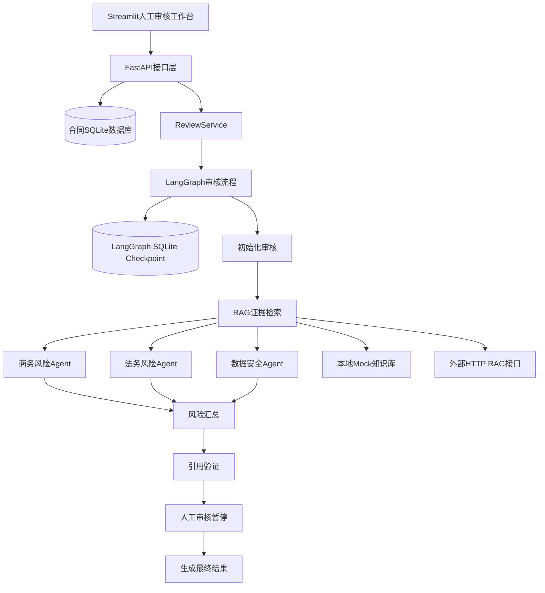

# RailGuard AI

RailGuard AI 是一个面向生产制造企业采购方的多 Agent 合同审核演示项目。

系统接收软件采购或技术服务合同，提取合同条款，通过 LangGraph 编排商务、法务和数据安全三个风险 Agent，结合 RAG 证据验证风险依据，并在流程暂停后等待人工审核人作出最终决定。

当前版本使用确定性风险规则和本地模拟知识库，保证面试演示结果稳定。真实大模型、监督微调和离线评测属于后续升级范围。

## 业务背景

系统服务于虚构企业“河北恒岳轨道装备有限公司”，以采购方立场审核设备监测平台软件采购与技术服务合同。

演示重点包括：

- 付款条件和验收条件是否对采购方不利
- 知识产权、源代码和成果归属是否明确
- 违约责任、质保期限和运维服务是否完整
- 数据访问、保存、删除和安全事件责任是否明确
- 每项风险能否定位到合同原文并关联知识库证据
- 人工审核人能否保留或驳回单项风险

企业、合同、审核规则和业务数据均为虚构或合成内容。本项目参考制造业公开业务模式，不代表与任何真实企业存在合作或授权关系。

## 当前功能

- DOCX和文本型PDF合同上传
- 最大10 MiB文件限制
- 合同文本提取和格式校验
- 合同条款切分及原文字符位置记录
- 合同数据SQLite持久化
- 可替换的本地Mock或HTTP RAG检索器
- 商务、法务和数据安全三个风险Agent
- 三个Agent并行执行
- 风险汇总、排序和引用来源验证
- LangGraph `interrupt` 人工审核暂停与恢复
- SQLite checkpoint持久化
- 服务重启后通过原审核ID恢复任务
- 单项风险保留或驳回
- 整体通过、拒绝或退回修改
- FastAPI合同与审核接口
- Streamlit人工审核工作台
- 网络错误、RAG错误和流程错误的结构化处理
- 自动化测试与Ruff代码检查

## 系统架构



## LangGraph流程

```text
START
  │
  ▼
initialize_review
  │
  ▼
retrieve_evidence
  │
  ├──────────────┬────────────────┐
  ▼              ▼                ▼
commercial     legal            security
risk_agent     risk_agent       risk_agent
  │              │                │
  └──────────────┴────────────────┘
                 │
                 ▼
        aggregate_findings
                 │
                 ▼
         verify_citations
                 │
        ┌────────┴────────┐
        │发现风险          │没有风险
        ▼                  ▼
   human_review       finalize_review
        │                  │
        ▼                  │
   finalize_review         │
        └────────┬─────────┘
                 ▼
                END
```

三个风险Agent分别写入独立状态字段，避免并行节点同时修改同一个列表。`aggregate_findings` 等待三个Agent全部完成后，再按照稳定顺序汇总结果。

发现风险时，`human_review` 使用 LangGraph `interrupt` 暂停。人工决定通过相同的 `review_id` 恢复流程，该ID同时作为 LangGraph `thread_id`。

## 技术栈

- Python 3.11
- FastAPI
- LangGraph
- LangGraph SQLite Checkpointer
- Pydantic
- HTTPX
- Streamlit
- SQLite
- python-docx
- PyMuPDF
- pytest
- Ruff

## 项目结构

```text
railguard-contract-review/
├── data/
│   └── demo/
│       ├── rag-corpus.json
│       └── software-purchase-demo.docx
├── src/railguard/
│   ├── api/            # FastAPI接口及依赖管理
│   ├── models/         # 合同、条款、证据和风险模型
│   ├── parsers/        # DOCX、PDF解析和条款切分
│   ├── rag/            # HTTP RAG适配器和本地Mock实现
│   ├── storage/        # 合同SQLite持久化
│   ├── ui/             # Streamlit界面和HTTP客户端
│   └── workflow/       # LangGraph状态、节点、图和审核服务
├── tests/              # 自动化测试
├── .env.example
├── pyproject.toml
└── README.md
```

## 本地安装

以下命令适用于Windows PowerShell。

### 1. 创建Python 3.11虚拟环境

```powershell
uv venv --python 3.11 .venv
```

### 2. 安装项目和开发依赖

```powershell
uv pip install --python .\.venv\Scripts\python.exe -e ".[dev]"
```

### 3. 创建本地配置

```powershell
Copy-Item .env.example .env
```

默认配置使用本地Mock风险分析和Mock RAG，不需要外部API密钥。

## 启动项目

后端和前端需要分别运行在两个PowerShell窗口中。

### 启动FastAPI后端

```powershell
& ".\.venv\Scripts\python.exe" -m uvicorn railguard.api.main:app --reload
```

后端地址：

- API文档：<http://127.0.0.1:8000/docs>
- 健康检查：<http://127.0.0.1:8000/health>

### 启动Streamlit前端

```powershell
& ".\.venv\Scripts\python.exe" -m streamlit run .\src\railguard\ui\app.py
```

默认前端地址：

- <http://localhost:8501>

## 演示流程

1. 打开Streamlit人工审核工作台。
2. 上传 `data/demo/software-purchase-demo.docx`。
3. 查看解析后的合同条款和原文位置。
4. 启动多Agent审核。
5. 查看三个Agent产生的风险、修改建议和RAG证据。
6. 对每项风险选择“保留风险”或“驳回风险”。
7. 选择整体通过、退回修改或拒绝合同。
8. 提交决定并查看最终审核摘要。

当前演示合同会稳定产生付款、验收、知识产权、违约责任、运维服务和数据安全等风险，便于重复演示完整流程。

## API接口

| 方法 | 路径 | 用途 |
|---|---|---|
| `GET` | `/health` | 查询服务状态和运行配置 |
| `POST` | `/contracts` | 上传、解析并保存合同 |
| `GET` | `/contracts/{contract_id}` | 查询已保存合同 |
| `POST` | `/contracts/{contract_id}/reviews` | 启动合同审核 |
| `GET` | `/reviews/{review_id}` | 查询审核状态和结果 |
| `POST` | `/reviews/{review_id}/decision` | 提交人工审核决定 |

## 数据持久化

项目使用两个独立SQLite文件：

```text
data/runtime/railguard.db
data/runtime/review-checkpoints.sqlite3
```

`railguard.db` 保存合同业务数据。

`review-checkpoints.sqlite3` 保存LangGraph审核状态，使暂停中的人工审核任务可以在后端服务重启后继续恢复。

当前版本没有自动过期时间。只要checkpoint数据库和工作流状态结构保持兼容，审核任务就可以继续查询和恢复。

## RAG运行模式

### 本地Mock模式

默认配置：

```dotenv
RAG_MODE=mock
RAG_MOCK_CORPUS_PATH=data/demo/rag-corpus.json
```

该模式使用合成审核规则，结果稳定，适合开发、自动化测试和面试演示。

### 外部HTTP模式

```dotenv
RAG_MODE=http
RAG_BASE_URL=http://localhost:8001
RAG_API_KEY=
RAG_TIMEOUT_SECONDS=10
```

HTTP适配器负责处理超时、连接失败、非成功状态码和无效响应。现有接口协议是临时协议，接入实际知识库时只需调整RAG适配层。

## 质量检查

执行Ruff：

```powershell
& ".\.venv\Scripts\python.exe" -m ruff check . --no-cache
```

执行全部测试：

```powershell
& ".\.venv\Scripts\python.exe" -m pytest -q
```

当前基线为63个测试通过。Starlette产生的一项AnyIO弃用警告来自第三方依赖，不影响当前功能。

## 关键设计选择

### 为什么使用LangGraph

合同审核不是一次模型调用，而是包含检索、多个专业Agent、结果汇总、引用验证、人工暂停和恢复的有状态流程。LangGraph负责显式节点编排、并行执行、条件路由和checkpoint恢复。

### 为什么保留Agent原始风险

`findings` 始终保留Agent产生并经过引用验证的原始风险，`final_findings` 保存人工审核后保留的风险。这样可以区分模型判断和人工决定，支持后续审计和效果评估。

### 为什么合同数据库和checkpoint分开

合同数据库属于业务数据，checkpoint属于工作流运行状态。分别保存后，可以独立迁移、备份和排查故障。

### 为什么当前使用确定性Agent

当前阶段优先验证端到端架构、数据协议、人工审核和持久化。确定性Agent使演示和测试可重复，并通过 `RiskAnalyzer` 接口保留真实大模型或微调模型的替换位置。

### 引用验证代表什么

`source_matched` 表示风险引用的证据ID、来源范围和风险分类能够匹配，不代表相关法律规则必然适用于真实合同。最终判断仍需要专业人员确认。

## 当前限制

- 风险Agent当前为确定性演示实现，尚未调用真实大模型
- 监督微调尚未实施
- Mock知识库内容为合成数据
- PDF仅支持文本型文件，尚未加入扫描件OCR
- 当前使用本地SQLite，演示部署建议运行单个Uvicorn工作进程
- 尚未加入用户认证、角色权限和多租户隔离
- 尚未建立生产级日志、指标、告警和备份策略
- 系统输出用于技术演示，不构成法律意见

## 后续计划

1. 建立合同审核训练集和评测集。
2. 接入基础大模型，形成提示词基线。
3. 对风险分类、理由和修改建议进行监督微调。
4. 比较规则基线、通用模型和微调模型的评测结果。
5. 接入真实RAG服务并补充知识库版本管理。
6. 增加OCR、身份认证和审计日志。
7. 增加Docker部署、健康检查和运行监控。